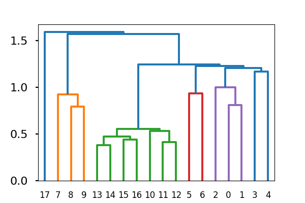
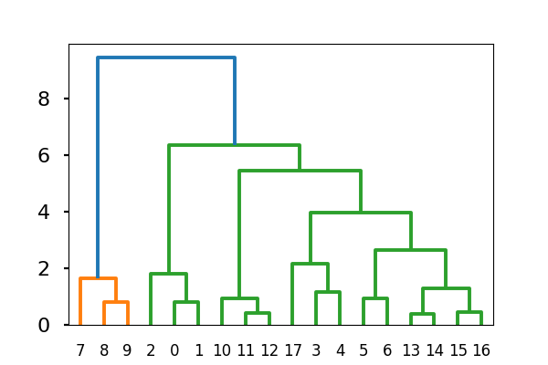
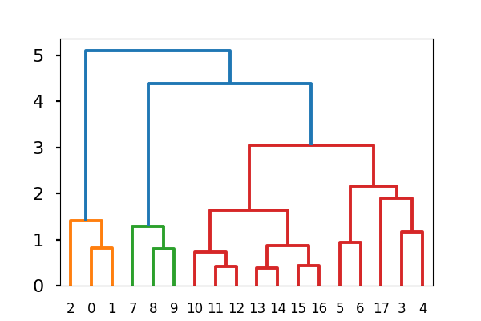

 

# Bayesian Hierarchical Clustering in python
This is a python implementation of the Bayesian Hierarchical Clustering algorithm proposed by Heller & Ghahramani (2005).
> HELLER, Katherine A.; GHAHRAMANI, Zoubin. Bayesian hierarchical clustering. In: **Proceedings of the 22nd international conference on Machine learning**. 2005. p. 297-304.

It also includes the Bayesian Rose Trees extension proposed by Blundell et al (2012).
> BLUNDELL, Charles; TEH, Yee Whye; HELLER, Katherine A. Bayesian rose trees. arXiv preprint arXiv:1203.3468, 2012.

## How to run the code
1. Create an anaconda environment using the file [environment.yml](environment.yml).

    `$ conda env create -f environment.yml`

2. Activate the environment after the installation is completed.

    `$ conda activate bayesian-hierarchical-clustering`

3. Run the file [example.py](example.py).

    `$ python example.py`

4. Check out the output images in the [results](results/) folder.

**Note**: You can optionally add your own data in the file [data.csv](data/data.csv) but the hyperparameters must be optimized.

## What to expect from the example code
A plot of the input data (2D). Suppose we want to find two clusters of data (orange and blue).

  

Dendrograms obtained from linkage algorithms. Notice that, none of them can tell us the presence of the two clusters.

   
   
  

A binary hierarchy obtained from the Bayesian hierarchical clustering algorithm. Notice that, two clusters have been identified containing the expected data points (leaves).

   

A non-binary hierarchy obtained from the Bayesian rose trees algorithm. Notice that, two clusters have been identified containing the expected data points (leaves).

   

## Contribute
All contributions are welcome, so don't hesitate to submit a pull request. ;-)

## Troubleshooting

If you run into issues with graphviz when running the example, you might need to install it through

`sudo apt-get install python-pydot python-pydot-ng graphviz`

## License
This code is released under GPL 3.0 License.

Check [LICENSE](LICENSE) file for more information.
